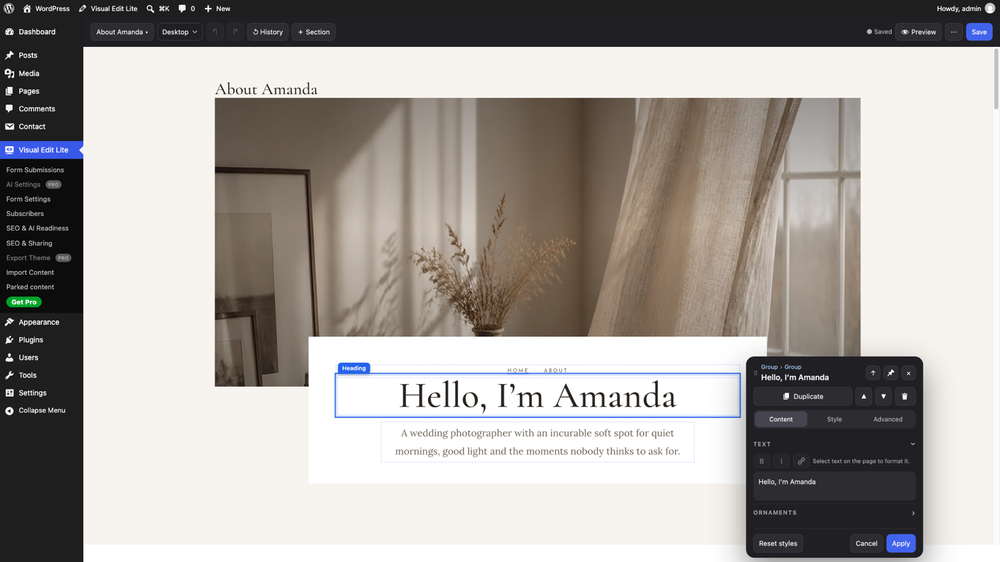
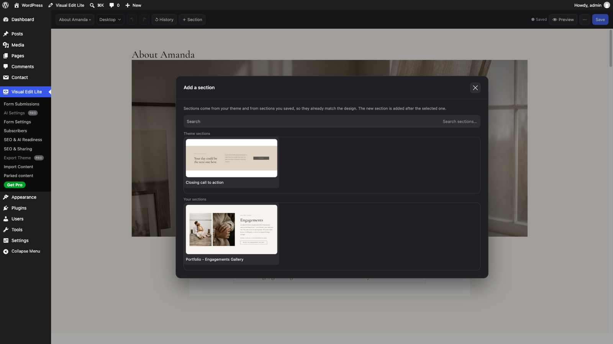

  

# Visual Edit Lite – Visual Editor for Block Themes

<!-- Once the directory listing is live, add: -->
<!--  -->
<!--  -->

Click any text, image or section on the live page and change it right there —
the design stays as it was built. For native Gutenberg block themes, and for
WordPress sites converted from hand-written or AI-generated HTML. This is the
free edition of [Visual Edit Pro](https://html2wp.dev/visualedit/).

  

- **Point-and-click editing** on the real page: typography, colour, spacing,
  layout and responsive controls per element, without touching the markup
- **Sections** from your theme and the ones you save, so new content matches
  the design
- **Save history** per page: every save is a restore point, and the Original
  can always be restored
- **Forms** that keep their designed markup — signed delivery, layered
  anti-spam, real email providers, no separate SMTP plugin
- **SEO & AI readiness**: titles, descriptions, Open Graph, structured data,
  `llms.txt`, and a read-only report that names what needs attention
- **Import** a content bundle or a full theme ZIP without overwriting what you
  already changed

  

## Install

- **Try it first** — [open it in WordPress Playground](https://playground.wordpress.net/?blueprint-url=https://raw.githubusercontent.com/iOSDevSK/visual-edit-lite/main/.github/playground/blueprint.json):
  a throwaway WordPress in your browser with the plugin installed, active and
  opened in the editor. Nothing to install, nothing is kept.
- **From WordPress.org** — Plugins → Add New → search for "Visual Edit Lite"
  → Install Now → Activate. *(Submitted to the directory; the listing is
  pending review.)*
- **From a release** — download `visual-edit-lite-X.Y.Z.zip` from
  [Releases](https://github.com/iOSDevSK/visual-edit-lite/releases/latest),
  then Plugins → Add New → Upload Plugin.

WordPress 6.6 or newer, PHP 7.4 or newer. No build step, no dependencies. The
theme and the plugin are two separate files: a theme ZIP never contains the
plugin.

## Support

- Bugs and feature requests: [GitHub Issues](https://github.com/iOSDevSK/visual-edit-lite/issues)
- Questions: the [WordPress.org support forum](https://wordpress.org/support/plugin/visual-edit-lite/),
  once the plugin is listed
- Security problems: [SECURITY.md](.github/SECURITY.md) — please not a public issue

---

## How it works

Visual editing for native Gutenberg block themes and WordPress sites converted
from hand-written or AI-generated HTML. Block themes keep the complete Site
Editor; converted themes keep their byte-identical markup and gain direct
click-to-edit controls on the real page.

On a block theme the VE workspace shows the page, one toolbar and one dark
popup, with WordPress's editor working underneath. Both editors share the
[`window.ClaraVE` editor API](docs/developer/editor-api.md); the
[acceptance matrix](docs/developer/workspace-parity.md) records what is
verified.

---

## What it needs from a theme

Native block themes work through Gutenberg without a VE contract. Raw-HTML
editing needs a converted theme that declares what its markup means through
the `clara_ve_theme_contract` filter.

**That contract is open and documented.** Everything a theme must provide is
written down in [`docs/developer/theme-requirements.md`](docs/developer/theme-requirements.md)
— a front-page pattern, a handful of template parts, a key marker per block,
and per-key structural anchors. Any theme can satisfy it, hand-written or
generated, and no part of it depends on a service.

In practice most such themes are produced by a converter that turns a finished
HTML site — one built in **Lovable, Bolt, aidesigner.ai, v0.dev, Claude
design**, or written by hand — into a WordPress theme with the original markup
intact. That converter is a separate project; this repository is the editor.

Install the plugin on a converted theme that declares the contract and the
raw-HTML editor opens. Install it on a native block theme and Visual Edit Lite
opens a VE workspace hosting WordPress's editor, with a floating inspector.

**It is not a page builder and does not work with one.** Elementor, Divi and
Beaver Builder store your page as their own data structure and render markup
from it; this plugin does the opposite, editing the markup the theme already
carries, in place. A page built by one of those gives it nothing to work on.

**Gutenberg block themes use Gutenberg itself.** The VE workspace hosts the
native Site Editor, so registered blocks, nested blocks,
Query Loops, navigation, patterns, templates, template parts and Global Styles
keep their complete WordPress controls and save through core's entity store.
Visual Edit Lite adds its popup, typography, Google Fonts, search appearance,
movement and responsive controls. The separate raw-HTML mode remains for themes that declare the
converter contract.

Parts of the plugin that do **not** depend on the theme — forms, email
delivery, mailing lists, the SEO record and emitter, redirects, structured
data and `llms.txt` — will still work anywhere. The editing canvas is the part
that needs the converted theme.

---

## What it does

**Editing**
- Native Gutenberg Site and Post Editors on block themes; click-to-edit on the
  live page for converted raw-HTML themes
- Typography, colour, spacing and layout controls per element, without
  touching the markup
- Edit CSS `::before` / `::after` ornaments, or promote one into real editable
  text
- Manage any set of repeating cards or list items — reorder, edit, add,
  remove — in one step
- Per-page version history with restore, kept independently for every page —
  ten saves deep plus the Original, all of it listed and all of it restorable

**Content**
- Connect a designed HTML form by clicking; the form's own markup is never
  rebuilt. Submissions are stored in WordPress and emailed
- Layered anti-spam: honeypot, minimum fill time, per-IP rate limiting that
  survives a CDN, and optional Akismet
- Email delivery through your server, SMTP, or the Brevo / SendGrid /
  Postmark / Mailgun APIs — no separate SMTP plugin
- Mailing-list signup with double opt-in and a subscriber consent record
- Blog listings that repeat the design's own card markup for real WordPress
  posts, with "load more"

**Search and AI readiness**
- Title, description, canonical, Open Graph and robots per page, edited from a
  small panel in the editor
- Writes through to Yoast SEO or Rank Math when either is installed, and emits
  the tags itself when neither is
- schema.org structured data, `llms.txt`, and AI-crawler rules — all extracted
  from the site's own content, never invented
- A read-only readiness report that names problems and stops there

**Moving a site**
- Import a converted theme's content bundle — pages, posts, menus, media,
  forms, SEO records
- Import reviews everything first and never overwrites work you have already
  done — conflicts are reported and left alone

---

## Lite and Pro

This is the free edition, distributed through the WordPress.org plugin
directory. It has no licence key, no trial and no locked buttons: what it does
not have, it does not contain.

[Visual Edit **Pro**](https://html2wp.dev/visualedit/) adds an AI assistant that edits pages conversationally, AI
image editing and video generation, Cloudflare Turnstile and one-click theme
export. None of that code is in this repository. It is sold separately and is not
required for anything Lite does. Both editions store their data under the same
names, so either one reads what the other wrote — and they cannot run at the
same time: with Pro active, Lite switches itself off and says so.

---

## Requirements

| | |
|---|---|
| WordPress | 6.6 or newer |
| PHP | 7.4 or newer |
| Capabilities | Gutenberg's normal entity capabilities; raw-HTML mode also needs `unfiltered_html` |
| Theme | native Gutenberg block theme, or a converted theme declaring `clara_ve_theme_contract` |

Raw-HTML editing requires `unfiltered_html`, the capability WordPress uses to
mean "this person is trusted with markup". Native block-theme editing uses
Gutenberg's normal per-page and site-editing permissions.

No build step, no Composer, no npm. The plugin has no dependencies.

---

## Documentation

Full documentation is in [`docs/`](docs/index.md).

- New here? Start with
  [Getting started](docs/getting-started/installation.md).
- Using the editor day to day?
  [The site owner's guide](docs/guide/the-editor.md).
- Integrating or extending?
  [Developer reference](docs/developer/architecture.md).

---

## License

GPL-2.0-or-later. See [LICENSE](LICENSE).

The editor is open source on purpose. It is delivered to every site it
converts, so it is code you can read, audit and keep — which matters for a
plugin that handles your markup, your form submissions and your subscriber
list. The converter is a separate project; this repository is the editor, and
its theme contract is documented so anyone can build against it.

## Verifying a build

    tools/verify.sh

Builds the package, boots a throwaway WordPress in Docker, installs the
extracted ZIP under its real slug, installs the official
[Plugin Check](https://wordpress.org/plugins/plugin-check/) if it is not
already there, runs it across every category, and asserts the Lite-specific
behaviour (no licence gate, no Pro classes, no AI routes, history keeping ten
saves plus the Original with every one of them restorable). Exits non-zero on any failure; `--keep` leaves the site up
on `localhost:8897`. Offline, point it at a local copy:
`PLUGIN_CHECK_ZIP=/path/to/plugin-check.zip tools/verify.sh`.

## Releasing

    tools/release.sh            # or: tools/release.sh X.Y.Z

Verifies, pushes, builds, tags (bare version — no `v` prefix), publishes the
GitHub Release with the ZIP attached, then **downloads the published asset
back and diffs it against a fresh build**. One command, because "push now,
release later" is how the download stops matching the code.

Release notes are read from the matching `= X.Y.Z =` block in `readme.txt`,
so the changelog has one home.

## Regenerating the translation template

    php tools/make-pot.php

Rewrites `languages/visual-edit-lite.pot` from the source. Run it after
changing any translatable string.
